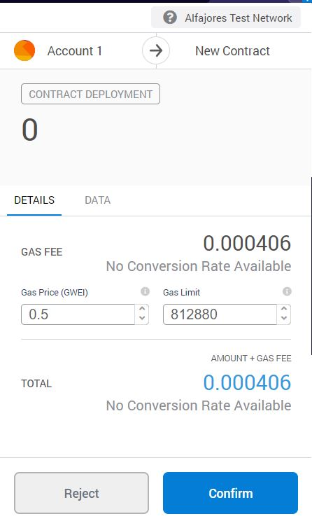
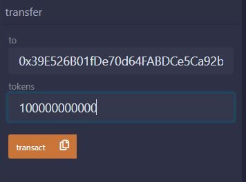
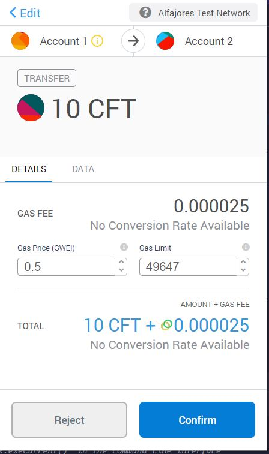
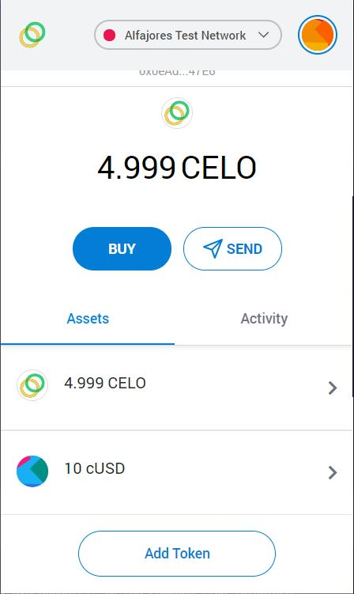
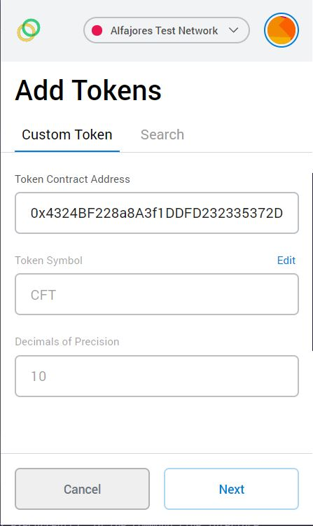
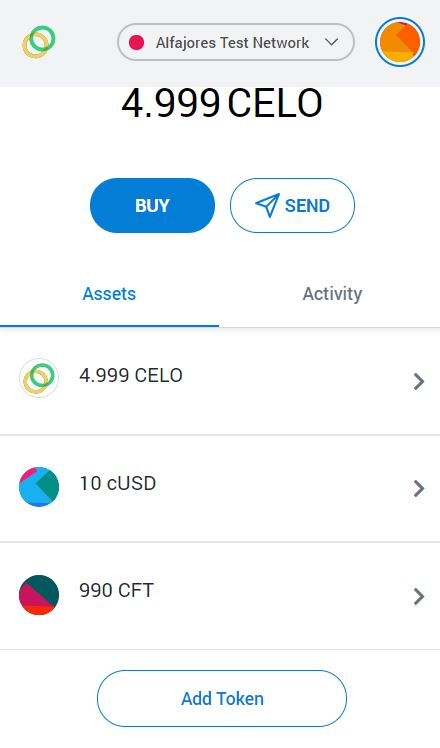

# How to mint your own fungible Celo Token

## Prerequisite:

1. Celo environment setup for Remix, tutorial for which can be found [here](https://github.com/figment-networks/datahub-learn/tree/297924b808c15ce2bb97c8963ea6d7640a4d3cf4/network-documentation/celo/tutorial/network-documentation/celo/tutorial/celo-for-remix.md)
2. Basic knowledge of [Solidity](https://https://solidity-by-example.org/) and the [Remix IDE](https://remix.ethereum.org)

## 1. What are tokens?

Tokens are a unit of measurement in the virtual world. It can represent any value the creator wants it to have.

For Example:

* `Shares of a company`
* `Player currency in Online games`
* `Unit of influence in governance of Defi projects`
* `Piece of Art or Media`
* `more ...`

## 2. Types of Tokens

Broadly these digital tokens can be classified into two categories:

### a. Fungible Tokens :

Fungibility means **replaceable** by another identical item. In simple terms, tokens that have equal value and are interchangable. This is identical to `Fiat currency`. Every Dollar is equal to every other Dollar of same value.

### b. Non-Fungible Tokens \(NFTs\):

As you can guess, these are exactly the opposite of fungible tokens. Every non-fungible token is `unique` thus can't be interchanged. Examples can be Digital Art or Songs.

In this example we will learn how to mint `fungible tokens`. We will use standard interface of `fungible tokens` that are quite popular on **Ethereum** and learn how to build similar tokens on **Celo**.

## 3. ERC20 Standard

ERC20 is a standard interface used on Ethereum to build fungible tokens.

This interface contains some **functions**

```javascript
//optional
function name() public view returns (string)
function symbol() public view returns (string)
function decimals() public view returns (uint)
//required
function totalSupply() public view returns (uint)
function balanceOf(address tokenOwner) public view returns (uint balance)
function allowance(address tokenOwner, address spender) public view returns (uint remaining)
function transfer(address to, uint tokens) public returns (bool success)
function approve(address spender, uint tokens) public returns (bool success)
function transferFrom(address from, address to, uint tokens)public returns (bool success)
```

and some **events**

```javascript
event Transfer(address indexed from, address indexed to, uint tokens)
event Approval(address indexed tokenOwner, address indexed spender, uint tokens)
```

that needs to be defined before deploying our smart contract on the blockchain.

In this tutorial, we will create a minimalistic version of ERC20 \(fungible\) tokens.

## 4. Defining Functions and Events

We have named our contract `CeloFungibleToken` and the implementation is given below. Create a new file on Remix `erc20.sol` and copy the code.

```javascript
// This contract should not be used in production

pragma solidity ^0.5.0;

contract ERC20Interface {
    function totalSupply() public view returns (uint);
    function balanceOf(address tokenOwner) public view returns (uint balance);
    function allowance(address tokenOwner, address spender) public view returns (uint remaining);
    function transfer(address to, uint tokens) public returns (bool success);
    function approve(address spender, uint tokens) public returns (bool success);
    function transferFrom(address from, address to, uint tokens) public returns (bool success);

    event Transfer(address indexed from, address indexed to, uint tokens);
    event Approval(address indexed tokenOwner, address indexed spender, uint tokens);
}


contract CeloFungibleToken is ERC20Interface{
    string public name;                          // name of the token
    string public symbol;                        // symbol of token
    uint8 public decimals;                       // divisibility of token
    uint256 public _totalSupply;                 // total number of tokens in existence

    mapping(address => uint) balances;
    mapping(address => mapping(address => uint)) allowed;


    constructor() public {
        name = "CeloFungibleToken";
        symbol = "CFT";
        decimals = 10; 
        _totalSupply = 10000000000000; // total tokens would equal (_totalSupply/10**decimals)=1000

        /** 
         decimals means the unit of divisibility we want for our tokens,
         For example if we want a divisibility of 10^(-3) and total supply of 1000 tokens then
         decimals = 3 and _totalSupply = 1000000

        **/


        balances[msg.sender] = _totalSupply;
        emit Transfer(address(0), msg.sender, _totalSupply);
    }

    function totalSupply() public view returns (uint) {
        return _totalSupply  - balances[address(0)];
    }

    function balanceOf(address tokenOwner) public view returns (uint balance) {
        return balances[tokenOwner];
    }


    // this function allows an address to give an allowance to another address (spender) 
    // to be able to retrieve tokens from it. 

    function allowance(address tokenOwner, address spender) public view returns (uint remaining) {
        return allowed[tokenOwner][spender];
    }

    function approve(address spender, uint tokens) public returns (bool success) {
        allowed[msg.sender][spender] = tokens;
        emit Approval(msg.sender, spender, tokens);
        return true;
    }

    function transfer(address to, uint tokens) public returns (bool success) {
        balances[msg.sender] = balances[msg.sender]- tokens;
        balances[to] = balances[to] +  tokens;
        emit Transfer(msg.sender, to, tokens);
        return true;
    }


     // this function moves the amount of tokens from sender to recipient and the given amount is 
     // then deducted from the caller’s allowance. 

    function transferFrom(address from, address to, uint tokens) public returns (bool success) {
        balances[from] = balances[from] -  tokens;
        allowed[from][msg.sender] = allowed[from][msg.sender] -  tokens;
        balances[to] = balances[to] + tokens;
        emit Transfer(from, to, tokens);
        return true;
    }
}
```

Our contract should be able to `Compile` now.

## 5. Deployment

We will deploy our contract on `Alfajores testnet`. We need to make sure that we have enough balance in our testnet account. We can get free testnet balance from [the Celo Developers faucet](https://celo.org/developers/faucet).

### Procedure

a. Select the account on Celo Wallet with which we want to deploy the smart contract. Make sure to select the account on `Alfajores Test Network`!

b. Click on **Deploy** button.  
 

c. Pay the `transaction fee` and sign the transaction using celo wallet.



**Congratulations!** we have deployed our very own Fungible token on the Celo blockchain. It usually takes around 5 seconds to achieve finality for our transactions. Once our transaction is confirmed, let's head over to [BlockScout](https://alfajores-blockscout.celo-testnet.org/) to see all the details.

[Here](https://alfajores-blockscout.celo-testnet.org/address/0x4324bf228a8a3f1ddfd232335372d5cbaae38cd1/transactions) are the details of the smart contract deployment shown in this example.

## 6. Transferring Token

Now that our contract is deployed, we have all the CFT tokens that exist on Celo Blockchain. Now we should also learn how to transfer these tokens from our account to others.

There are many ways of transferring tokens from one address to another. We will discuss a couple of methods. **1. SMART CONTRACT INTERACTION** :

a. Select the account which has 1000 CFT, in the example case `0x0eAd666A5B65ED614990fD582693039ed49847E6` \(which you can verify on Blockscout using the link given above\) on Celo extension wallet.

b. In the transfer tab and we need to enter the **Alfajores Testnet Address** of the account to which we want to transfer the tokens with the amount of tokens to be transferred. For this tutorial, we will use `0x39E526B01fDe70d64FABDCe5Ca92b47789AA231D` and send 10 CFT tokens \(be mindful of decimals that we defined in the contract\).



c. Click on `Transact`



d. Pay the `transaction fee`

With that, we have learned how to transfer your fungible tokens to other addresses. But there is still a problem, we aren't able to see our tokens on our Celo wallet. To display the tokens we'll need to

a. Select the **Add Token** button on our Celo wallet as shown in the image.



b. Enter the contract address in **Token Contract Address** and click `Next`.



c. Click on `Add token`

Now we are able to see our token balance!



**2. Celo Wallet**

After adding the token address to our wallet, simply click on the `Send` button and input the address of a recipient. Tokens will be transferred after signing the transaction and paying the `transaction fee`.

## Conclusion

This was a very interesting tutorial. In this tutorial, we learned: 1. Some different use cases of Fungible tokens 2. There are different types of tokens with different standards 3. How to deploy a custom Fungible token on the Celo blockchain 4. How to send tokens over Celo!

We cannot wait to see what you create!

