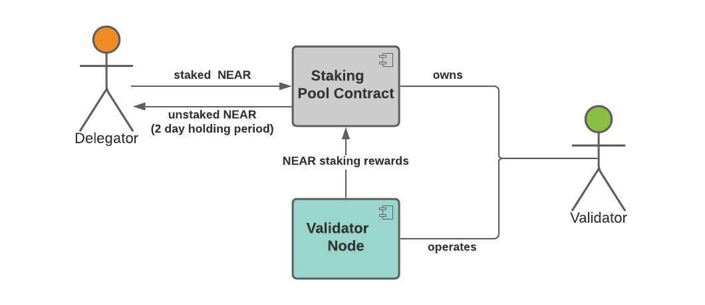

# You Can Have Your STAKE and Trade It Too

## Show Me the Money: You Can Have Your STAKE and Trade It Too
Plain old vanilla staking is a great way to earn more NEAR, but their are some trade-offs to be aware of. One of the main 
trade-offs is that the staked NEAR is locked because it is effectively put up as collateral to help secure the NEAR network. 
We can do better than that by unlocking the value. The [STAKE][1] contract unlocks the value stored in the staked NEAR by 
transforming it into a [fungible token][3]. You can now have your STAKE and trade it too.

In this tutorial we'll learn about how staking works on NEAR. We'll see how the STAKE token adds and unlocks value. We'll
apply what we learned from the [fungible token][3] tutorial and implement the fungible token core NEP-141 standard in my
favorite programming language, Rust. We will take it step by step and divide it up into 3 phases - design, coding, and last 
but most important is testing. Finally, we'll deploy to testnet and take it for a test drive. There's a lot to cover, 
so let's get started ...

## NEAR Staking 101

The NEAR protocol is a Proof-of-Stake (PoS) blockchain. Those who participate in staking to help secure the blockchain 
network earn staking rewards paid in NEAR tokens. There are two ways to participate:

#### As a **Validator**
Validators are responsible for running and operating the validator nodes that are actively producing blocks and must
come to a stake-weighted consensus about the valid state of the chain. On NEAR, the number of validator nodes per shard
is limited (currently 100 per shard). Anyone can submit a proposal to become a validator, but validator seats are auctioned
off to the highest bidders, i.e., those that who stake the most NEAR.
#### As a **Delegator**
Anyone can earn staking rewards by delegating their NEAR tokens to a validator through a [staking pool][2] contract.
Here's how it works:
1. Each deployed staking pool contract instance is owned by a single validator. 
2. Users deposit NEAR into the staking pool contract. Recall that validator seats are auctioned off to the highest bidder.
  Delegators pool their NEAR with validators to help them win auction bids for validator seats. Staking rewards earned
  by the validator are shared with the delegator minus validator fees. 
3. While delegated NEAR is deposited in the staking pool, it is effectively locked. While being staked, the delegated 
  NEAR is owned by the staking pool contract (which is owned by the validator). Effectively, delegators are lending
  their NEAR to validators through the staking pool contract. Delegators return on investment is their share of staking
  rewards - assuming the validator acquires a seat and does his job. 
4. When delegators choose to withdraw their NEAR they must first unstake the NEAR. The unstaked NEAR will remain locked 
  within the staking pool for 4 epoch periods (2 days) before being eligible for withdrawal from the staking pool contract.
   - **ATTENTION**: One thing users need to be aware and careful about is how the unstaking lock period functions in 
     the current version staking pool contract implementation. Each time the user submits a request to unstake NEAR it
     resets the lock period to 4 epochs (2 days). For example, if a user unstaked 1000 NEAR in epoch (1), then the 1000 NEAR
     will be available for withdrawal in epoch (4). What happens if the user submits another request to unstake 1 NEAR
     on epoch (3)? When you try to withdraw the 1000 NEAR in epoch (4), it is still locked because the lock period has
     been reset and extended for all unstaked NEAR. The 1001 NEAR will no be available for withdrawal in epoch (7).

For more information on how staking works on NEAR see:
- [Economics in a Sharded Blockchain - Validators section](https://near.org/papers/economics-in-sharded-blockchain/#validators)
- [Is NEAR a delegated proof of stake network](https://docs.near.org/docs/faq/economics_faq#is-near-a-delegated-proof-of-stake-network)
- [Staking Orientation](https://docs.near.org/docs/validator/staking-overview)

# You Can Have Your STAKE and Trade It Too

When you deposit NEAR into the STAKE token contract, it will delegate the NEAR to the staking pool for you. In return you 
are issued STAKE tokens that grow in value via staking rewards issued through the staking pool contract. STAKE tokens unlock 
the value of the staked NEAR that is locked up by the staking pool contract. The STAKE token contract adds even more value
beyond letting you use staked NEAR as fungible tokens. However, we'll save that for future tutorials. For now, we'll
stay focused on how the STAKE token implements [NEP-141][3].

## Show Me the Design

## Show Me the Code

## Show Me the Tests

## Show Me the Demo

## It's a wrap folks...

## What's Next ...

[1]: https://github.com/oysterpack/oysterpack-near-stake-token
[2]: https://github.com/near/core-contracts/tree/master/staking-pool
[3]: 2-fungible-token.md